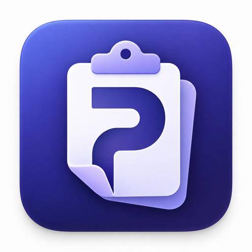
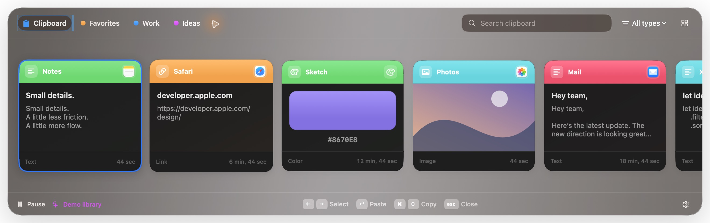

# Pastrix

**A little more flow. A lot less copying.**

Pastrix is a native clipboard manager for macOS. It keeps recent clips in a visual shelf, lets you organize the ones that matter, and can paste a short queue in order.

> **Early public preview.** Pastrix 1.2.2 is built for Apple Silicon Macs running macOS 14 or later. The download is ad-hoc signed and is not notarized.

## Download

**[Download Pastrix 1.2.2 for Apple Silicon](https://github.com/davidgrossman/Pastrix/releases/download/v1.2.2/Pastrix-1.2.2-macOS-arm64.zip)**

You can also browse [all releases](https://github.com/davidgrossman/Pastrix/releases) or [visit the project site](https://davidgrossman.github.io/Pastrix/).

Download [SHA256SUMS.txt](https://github.com/davidgrossman/Pastrix/releases/download/v1.2.2/SHA256SUMS.txt) beside the ZIP, then run `shasum -a 256 -c SHA256SUMS.txt` in that folder to verify it.

Unzip the download, move **Pastrix.app** to Applications, then Control-click the app and choose **Open**. If macOS still blocks it, open **System Settings → Privacy & Security** and choose **Open Anyway**.

**Upgrading from Paster:** Quit Paster before opening Pastrix, and replace the old application rather than running both copies. Your history stays in its existing folder. If launch at login was enabled, switch it off and on in Pastrix so macOS registers the renamed app.

Accessibility permission is optional. Pastrix asks for it only when you enable direct paste or use a clip queue with ordinary ⌘V. Copying, search, pinboards, and history work without that permission.

## What it does

- Captures text, links, colors, images, PDFs, rich text, and Finder file references.
- Finds clips by content, source app, or type.
- Keeps important clips on colored pinboards.
- Opens with ⌘⇧V and supports keyboard navigation and a five-item Quick Menu.
- Collects a run of copies into a session queue and pastes them back in order.
- Creates snippets, renames clips, shares through the macOS share sheet, and supports JSON backup and restore.
- Pauses capture, excludes apps, and bounds history by age, count, and size.

Pastrix is a local app. It has no account, telemetry, advertising, or cloud history. It contacts GitHub only when you explicitly choose **Check for Updates**. **Send Feedback** lets you write and save a local draft or open GitHub’s issue form yourself; it does not upload the draft or attach clipboard history.

## Privacy

History lives in:

    ~/Library/Application Support/Paster/history.sqlite

The database is restricted to your macOS account, but its contents are not separately encrypted by Pastrix. FileVault is recommended for protection at rest. JSON backups also contain readable clipboard data and should be stored privately.

Sensitive clipboard markers and common password-manager apps are excluded by default. Because an app can copy a secret as ordinary text, you should also add sensitive apps to Pastrix’s excluded-app list or pause capture when needed.

## Shortcuts

| Shortcut | Action |
| --- | --- |
| ⌘⇧V | Open Pastrix |
| Return | Paste selected clip |
| ⇧Return | Paste as plain text |
| ⌃⌘V | Paste next queued clip |
| ⌘1–9 | Quick-paste a visible clip |
| ⌘F | Search |
| Arrow keys | Move through clips |
| Escape | Close the shelf |

## Build from source

Pastrix uses Swift 6, SwiftUI, AppKit, and system SQLite. It has no third-party package dependencies.

Requirements: macOS 14 or later, Apple Silicon, and a Swift 6 toolchain.

    git clone https://github.com/davidgrossman/Pastrix.git
    cd Pastrix
    swift test
    ./scripts/build-app.sh
    open dist/Pastrix.app

The bundle script creates an ad-hoc-signed app at **dist/Pastrix.app** and a ZIP archive. A Developer ID signature and Apple notarization are separate distribution steps.

For an isolated interface preview that never reads or writes the system clipboard:

    dist/Pastrix.app/Contents/MacOS/Pastrix --demo

## Contributing

Start with the [contributor guide](CONTRIBUTING.md) and [roadmap with bounded starter tasks](ROADMAP.md). Bug reports, focused fixes, and thoughtful Mac-native improvements are welcome. Please [open an issue](https://github.com/davidgrossman/Pastrix/issues/new/choose) before beginning a large change.

Tests and demo data must use isolated fixtures. Never read or log a contributor’s real clipboard history during development.

Pastrix is available under the [MIT License](LICENSE).

## Project map and release status

| Path | Purpose |
| --- | --- |
| `Sources/Pastrix` | Native UI, clipboard capture, SQLite storage, queue and sharing |
| `Tests/PastrixTests` | Synthetic clipboard, persistence, migration, queue and release tests |
| `scripts` | Reproducible icon generation and portable release packaging |
| `resources` | App metadata, Pastrix icon master, generated iconset, and `.icns` bundle icon |
| `docs` | Architecture, privacy, release notes and the GitHub Pages showcase |

All 47 automated tests pass locally, including rebrand compatibility checks for the existing data location and bundle identifier. Pastrix 1.2.2 keeps the same compatibility limits: the target is macOS 14+ on Apple Silicon, while older target versions, external-app paste, pointer drag/drop, prolonged use and multiple displays still need broader real-world checks. No Intel download is supplied. See [release notes](docs/RELEASE-1.2.2.md), [architecture](docs/ARCHITECTURE.md), and [privacy details](docs/PRIVACY.md).

Pastrix is an independent project inspired by visual clipboard workflows. It is not affiliated with Paste, Clipbara or Apple. No Paste or Clipbara source code or branding is included. OCR, AI, MCP and cross-device sync are not implemented.
